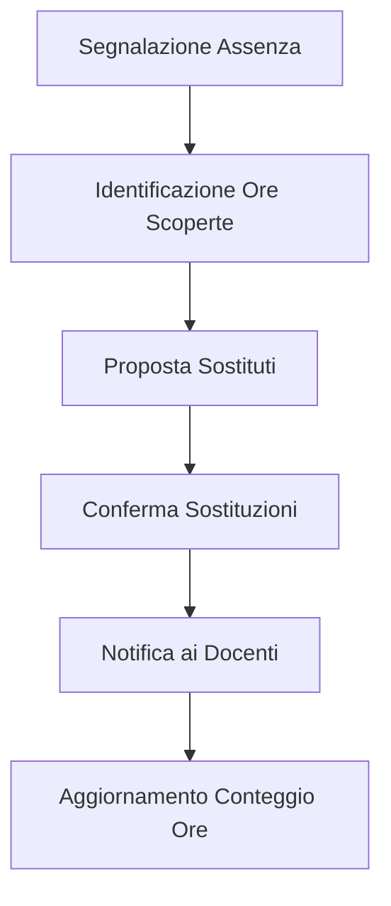

<div align="center">
  
# 🏫 Othoca Labs - Sistema di Gestione Sostituzioni Docenti

[](https://opensource.org/licenses/MIT)
[](https://nodejs.org/)
[](https://www.mongodb.com/)
[](https://reactjs.org/)
[](https://nextjs.org/)

*Semplifica la gestione delle sostituzioni docenti con un'applicazione web moderna ed efficiente*


</div>

---

## 📋 Panoramica

Othoca Labs è una web application completa progettata per automatizzare e semplificare la gestione delle sostituzioni dei docenti, monitorare ore di avanzo/disavanzo e ottimizzare la gestione del personale docente nelle istituzioni scolastiche.

<div align="center">
  
</div>

## ✨ Caratteristiche

### 👤 Gestione Utenti
- **Multi-ruolo**: Sistema con ruoli differenziati (admin, vicepresidenza, docente)
- **Autenticazione sicura**: Login protetto con JWT
- **Profili personalizzati**: Gestione completa dei profili docenti

### 📊 Gestione Dati
- **Importazione intelligente**: Carica orari e assenze da file Excel/CSV
- **Modifica intuitiva**: Interfaccia user-friendly per modifiche manuali
- **Sincronizzazione**: Dati sempre aggiornati in tempo reale

### 🔄 Sostituzioni Smart
- **Selezione automatica**: Algoritmo che propone i sostituti ideali
- **Notifiche immediate**: I docenti vengono informati in tempo reale
- **Gestione semplificata**: Interfaccia intuitiva per la vicepresidenza

### ⏱️ Monitoraggio Ore
- **Ore da recuperare**: Controllo preciso delle ore da compensare
- **Gestione ore buche**: Ottimizzazione dell'orario scolastico
- **Ore extra**: Monitoraggio delle ore aggiuntive retribuite

### 📝 Report ed Analytics
- **Statistiche dettagliate**: Visualizzazione dell'andamento
- **Esportazione dati**: Report in formato stampabile
- **Dashboard personalizzate**: In base al ruolo dell'utente

## 🛠️ Stack Tecnologico

### Frontend
- **Framework**: React con Next.js
- **Gestione Stato**: Context API
- **Routing**: Next.js Router
- **API**: Fetch API
- **Stile**: CSS Modules

### Backend
- **Framework**: Node.js con Express
- **Database**: MongoDB
- **Autenticazione**: JWT (JSON Web Token)
- **Validazione**: Express Validator

## 🚀 Installazione

### Clonare il Repository
```bash
git clone https://github.com/OthocaLab/gestionaleDocenti
cd gestionaleDocenti
```

### Collegamento SMTP
- **Attivazione 2fa**: [2FA](https://myaccount.google.com/security)
- **Creazione SMTP_PASSWORD**: [SMTP_PASSWORD](https://myaccount.google.com/apppasswords)

## 🔧 Configurazione

### Backend
```bash
# Navigare nella cartella del server
cd server

# Installare le dipendenze
npm install
```

Creare un file `.env` nella cartella server:
```
NODE_ENV=development
PORT=3000
MONGODB_URI=mongodb://localhost:27017/othoca-labs
JWT_SECRET=il_tuo_jwt_secret_sicuro
JWT_EXPIRE=30d
EMAIL_SERVICE=gmail
EMAIL_USERNAME=tua_email@gmail.com
EMAIL_PASSWORD=tua_password_app
EMAIL_FROM=noreply@othocalabs.it
```

### Frontend
```bash
# Navigare nella cartella del client utilizzando un secondo terminale (Ctrl + Shift + ò)
cd client

# Installare le dipendenze
npm install
```

## 🏃‍♂️ Avvio dell'Applicazione

### Backend (Primo terminale)
```bash
cd server
npm run dev
```

### Frontend (Secondo terminale)
```bash
cd client
npm run dev
```
L'applicazione sarà disponibile all'indirizzo: [http://localhost:3000](http://localhost:3000)

## 📁 Struttura del Progetto

```
othoca-labs/
├── client/                  # Frontend Next.js
│   ├── public/              # File statici
│   ├── src/                 # Codice sorgente
│   │   ├── components/      # Componenti React
│   │   ├── context/         # Context API
│   │   ├── hooks/           # Custom hooks
│   │   ├── pages/           # Pagine Next.js
│   │   ├── styles/          # File CSS
│   │   └── utils/           # Utility functions
│   ├── .env.local           # Variabili d'ambiente frontend
│   └── next.config.js       # Configurazione Next.js
│
├── server/                  # Backend Node.js/Express
│   ├── config/              # Configurazioni
│   ├── controllers/         # Controller API
│   ├── middleware/          # Middleware Express
│   ├── models/              # Modelli Mongoose
│   ├── routes/              # Route API
│   ├── utils/               # Utility functions
│   ├── .env                 # Variabili d'ambiente backend
│   └── server.js            # Entry point del server
│
└── README.md                # Documentazione del progetto
```


## 👥 Ruoli Utente

| Ruolo | Permessi |
|-------|----------|
| **Amministratore** | Gestione completa degli utenti<br>Configurazione del sistema<br>Accesso a tutte le funzionalità |
| **Vicepresidenza** | Gestione delle sostituzioni<br>Approvazione delle assenze<br>Generazione di report |
| **Docente** | Visualizzazione del proprio orario<br>Richiesta di assenze/permessi<br>Visualizzazione delle sostituzioni assegnate |

## 🔄 Flusso di Lavoro



1. La segreteria o il docente segnala un'assenza
2. Il sistema identifica le ore scoperte
3. Il sistema propone i docenti sostituti in base ai criteri configurati
4. La vicepresidenza conferma le sostituzioni
5. I docenti sostituti ricevono una notifica
6. Il sistema aggiorna il conteggio delle ore da recuperare

## 👨‍💻 Contribuire al Progetto

1. Fork del repository
2. Creare un branch per la nuova feature (`git checkout -b feature/nome-feature`)
3. Commit delle modifiche (`git commit -m 'Aggiunta nuova feature'`)
4. Push al branch (`git push origin feature/nome-feature`)
5. Aprire una Pull Request

## 📜 Licenza

Questo progetto è rilasciato sotto licenza [MIT](https://opensource.org/licenses/MIT).

## 📞 Contatti

Per domande o supporto, contattare Andrea Siddi di Uras.

---

<div align="center">
  
Sviluppato con ❤️ dal team Othoca Labs

</div>
